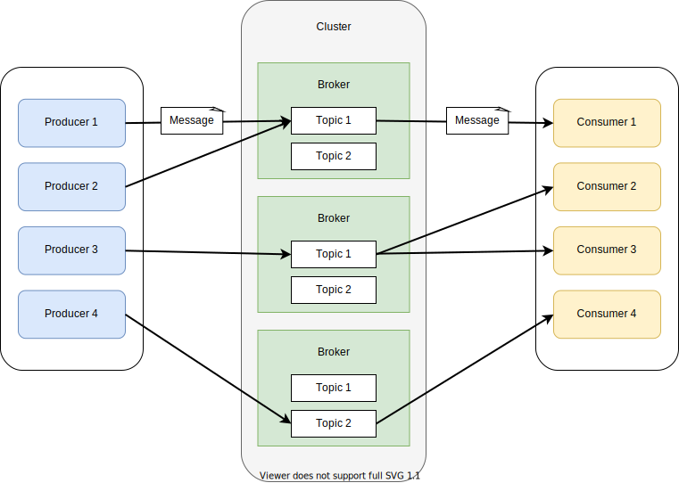

# 카프카 구조

카프카의 주요 구성 요소는 다음 5가지다.

- 브로커
  - 데이터를 송수신하는 서비스
- 메시지
  - 카프카 데이터의 최소 단위, Key와 Value를 가짐
  - 배치 처리 제공
- 프로듀서
  - 메시지 생산자, 프로듀서 API를 이용하여 브로커로 메시지를 푸쉬하는 애플리케이션
- 컨슈머
  - 메시지 소비자, 컨슈머 API를 이용하여 브로커로부터 풀한 메시지를 다루는 애플리케이션
- 토픽
  - 메시지를 종류별로 관리하는 스토리지, 브로커에 배치되어 관리됨

## 시스템 구성

#### 브로커

1. 데이터를 송수신 하는 중계 서비스
2. 여러 클러스터로 구성할 수 있으며, 브로커를 추가함으로써 처리량 향상
3. 데이터들은 모두 디스크로 저장됨

**데이터 보관 정책**

- 오래된 메시지 삭제
  1. 지정한 시간보다 오래된 데이터 삭제
  2. 지정한 데이터 크기보다 커진 경우 데이터 삭제
- 압축
  - 최신 key의 데이터를 남겨두고 중복된 key의 오래된 메시지 삭제

#### 프로듀서

카프카에서 제공하는 프로듀서 API 이용하여 <mark>메시지를 브로커로 push하는 애플리케이션</mark>

#### 컨슈머

카프카에서 제공하는 컨슈머 API 이용하여 <mark>브로커에서 메시지를 pull하는 애플리케이션</mark>

#### 주키퍼

분산 메시징의 메타데이터(토픽과 파티션 등)를 관리하기 위한 구성 요소

- 설정 관리
- 이름 관리
- 잠금 관리

#### 카프카 클라이언트

토픽 작성 등 카프카의 동작 및 운영 상에 필요한 조작을 실행하는 서버

## 메시징 구조

#### 파티션

- 토픽은 파티션이라는 단위로 분할되어 있다. 
- 파티션은 대량의 데이터 입출력을 처리하기 위해 브로커 클러스터에 분산 배치된다.
- 메시지 Key의 지정 여부에 따라 두가지 로직으로 파티션 할당
  - Key가 `NULL` 일 때, 라운드 로빈 방식으로 파티션 할당
  - Key를 지정할 경우 동일한 키를 가진 메시지는 동일한 ID를 가진 파티션에 할당

#### 컨슈머 그룹

여러 컨슈머가 단일 토픽이나 여러 파티션에서 메시지를 취득하는 방법

#### 오프셋

- 메시지의 위치를 나타내는 관리 정보
- 오프셋을 이용해 메시지의 범위 및 재시도를 제어한다.
- Offset 종류
  - Log-End-Offset(LEO)
    - 파티션 데이터의 끝을 나타낸다.
    - 브로커에 의해 파티션에 관한 정보로 관리 및 업데이트 된다.
  - Current Offset
    - 컨슈머가 어디까지 읽었는가를 나타낸다.
    - 컨슈머 그룹마다 보관되어 관리, 업데이트된다.
  - Commit Offset
    - 컨슈머가 어디까지 커밋했는지를 나타낸다.
    - 컨슈머의 Offset Commit 요청을 계기로 업데이트 된다.

## 메시징 복제 구조

장애 발생 시 메시지를 잃지 않기 위해 Replication 지원

#### In-Sync Replica (ISR)

Leader Replica의 복제 상태를 유지하고 있는 레플리카

#### High Wartermark

High Wartermark는 복제가 완료된 오프셋이며 반드시 LEO과 동일하거나 오래된 오프셋을 나타냄.

#### 메시지 도달 보증 수준

프로듀서가 브로커에 메시지 전달 보증

- `0`: 프로듀서는 Ack를 기다리지 않고 다음 메시지 송신
- `1`: Leader Replica에 메시지가 전달되면 Ack 반환
- `all`: ISR 수만큼 복제되면 Ack 반환

#### In-Sync Replica와 Ack=all의 관계

브로커 서버가 4대, 레플리카 수는 3일 때 브로커 1대가 고장난 경우를 비교한다.

1. min.insync.replicas=3, Ack=all인 경우

   브로커 서버가 1대 고장난 경우 프로듀서는 비정상 상태로 간주하여 잃어버린 레플리카가 ISR로 복귀할 때까지 데이터를 쓸 수 없다.

2. min.insync.replicas=2, Ack=all

   1번 처럼 메시지를 쓸 수 없는 상황은 아니지만 메시지를 손실할 위험이 높아진다.

위의 상황은 어느쪽이 더 나은 설정이라는 것이 아니라 요구사항이나 제약 조건에 의해 결정돼야 한다.

